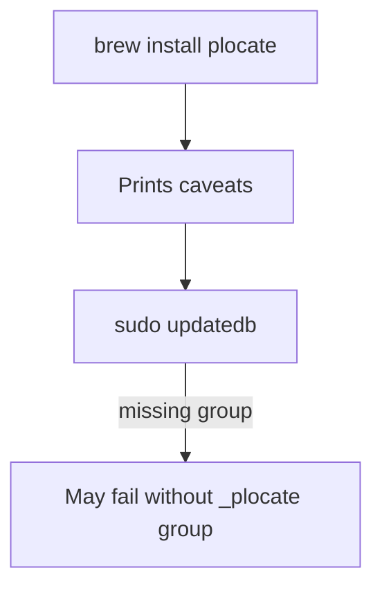

# Sketch: Improve formula caveats with --require-visibility no

COVERS:
- Formula/plocate.rb (caveats only)

## Current State

## What I'm Changing
Add `--require-visibility no` to caveats so the simple path works without group setup.

## What Must NOT Break
- Formula still installs
- brew test still passes

## How I'll Verify It Works
- [ ] Read caveats output after change
