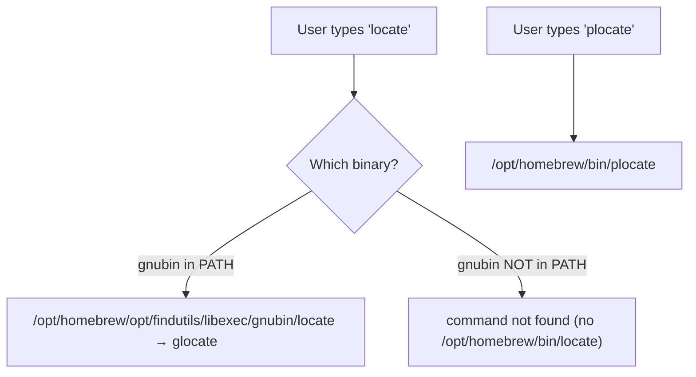
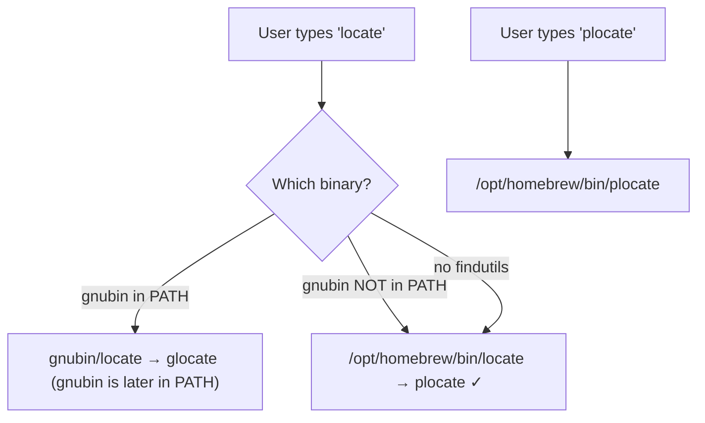

# Sketch: Add locate -> plocate symlink in formula

COVERS:
- Formula/plocate.rb

## Current State

## After Change

## What I'm Changing
Adding `bin.install_symlink "plocate" => "locate"` to put a locate symlink in /opt/homebrew/bin/.
No conflict: findutils only puts locate in libexec/gnubin/ (opt-in), not in bin/.

## What Must NOT Break
- plocate binary still works
- No conflict with findutils package
- brew install still succeeds

## How I'll Verify It Works
- [ ] brew reinstall succeeds
- [ ] which locate shows /opt/homebrew/bin/locate
- [ ] locate --version shows plocate
